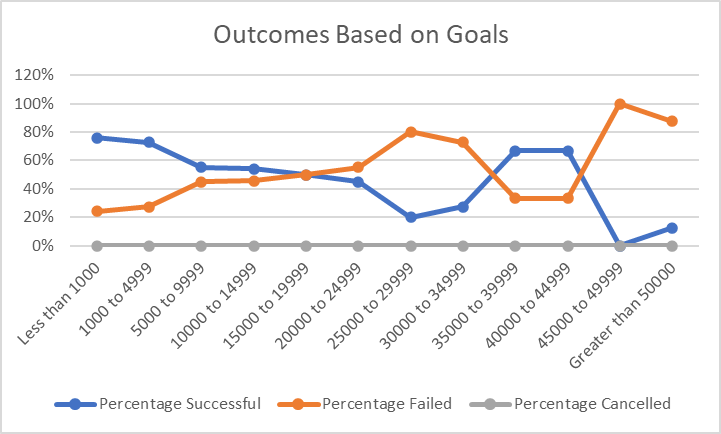

# Module 1 Challenge: An Analysis of KickStarter Campaigns- Michael Berg
Conclusion 1: Plays tend to be highly successful KickStarter campaigns, as overall they have a 66% success rate, versus ~54% for the broader KickStarter campaign (excludes live projects). In particular, the smaller KickStarter campaigns tend to be more successful within plays, and then gradually tail off as as the goals get largere, beginning with 76% for <$1000 goals. However, from $30,000 to $44,999, plays saw an uptick in success, before dropping off a cliff from 45,000 and above. Failures were the exact inverese of successes (of completed campaigns) as there are no current live campaigns. The exhibit below highlights the trend of success and failures by funding goal. 
---
Conclusion 2: xxx 
---
Conclusion 3: xxx 
---
Limitations of the dataset: xxx 
---
Suggestions for additional tables or graphs: 
---
